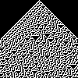

# Elementary Cellular Automata in Python

This is a simple python implementation of S. Wolfram's elementary cellular automata.

When run it will output images for each of the 256 rules.

I'm sure this could be more succinctly implemented, but the functions are supposed to be mostly self-explanatory.

Here is an example of rule 30:

## Acknowledgements

Check out [Wolfram Mathworld](https://mathworld.wolfram.com/CellularAutomaton.html) for more info.

## Licence
[MIT](https://choosealicense.com/licenses/mit/)
